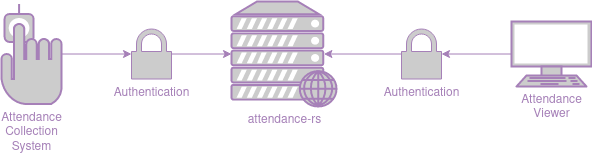

# attendance-rs

This is our attendance server for RCSC. 

## Attendance Architecture

The attendance server here plays only one small (but important) role in the attendance system. The attendance server is the centralized repository to store all the attendance. 

Attendance collection systems (which *will* require authentication to upload to `attendance-rs`) will upload attendance data to the attendance server by using a mutation in the GraphQL API. After this is done, attendance viewers will visually display the attendance data, querying from the GraphQL API. We will probably implement access controls to prevent collection systems from reading the data in our attendance database and interfaces from writing to the database (more the latter than the former though).

This diagram explains where `attendance-rs` is located in the RCSC attendance pipeline.



## Running `attendance-rs`

Setting up `attendance-rs` requires a working PostgreSQL server. Once you have this, you must migrate the migrations in the `migrations` directory. To do this easily, you should configure the environment variables `DATABASE_URL` so that migrations will work with the `sqlx-cli`, which makes migrations easy to create and run (`attendance-rs` also uses this environment variable to connect to the database, so you must set it).
Install `sqlx-cli` with `cargo install sqlx-cli`, then create a `.env` file that contains the following (you could also set these environment variables in any other way you see fit): 

```
DATABASE_URL=postgres://USER@HOST/DATABASE
```

Replace `USER`, `HOST`, and `DATABASE` accordingly.

Then, to execute the migration:

``` sh
sqlx migrate run
```

You need to set two more environment variables for the web service to start (this is for the JWT authentication token generation). You need to generate a PKCS8 private key file with an ECDS key. You also need to generate a public key from that private key. To generate these keys easily, install `openssl` on your system, and then run `gen_keys.sh` with `./gen_keys.sh`. Then set `AR_PG_PRIVATE_KEY` to `private_key.pem` and `AR_PG_PUBLIC_KEY` to `public_key.pem`. **Without generating public and private keys and setting these environment variables, the program will not start.**

You can set one other environment variable in the `.env` file (or wherever else you'd like). This is for setting the HTTP host/port (this *is* optional and defaults to `127.0.0.1:8080`). Your `.env` could look like this:

``` 
DATABASE_URL=postgres://USER@HOST/DATABASE
AR_PG_HTTP_HOST_STR=0.0.0.0:9000
AR_PG_PRIVATE_KEY=public_key.pem
AR_PG_PUBLIC_KEY=public_key.pem
```

You can start the server with `cargo run` once the required environment variable is set and the migrations have finished. Navigate to your `AR_PG_HTTP_HOST_STR` (or the default value) in a web browser to play with the API in the GraphQL playground.
